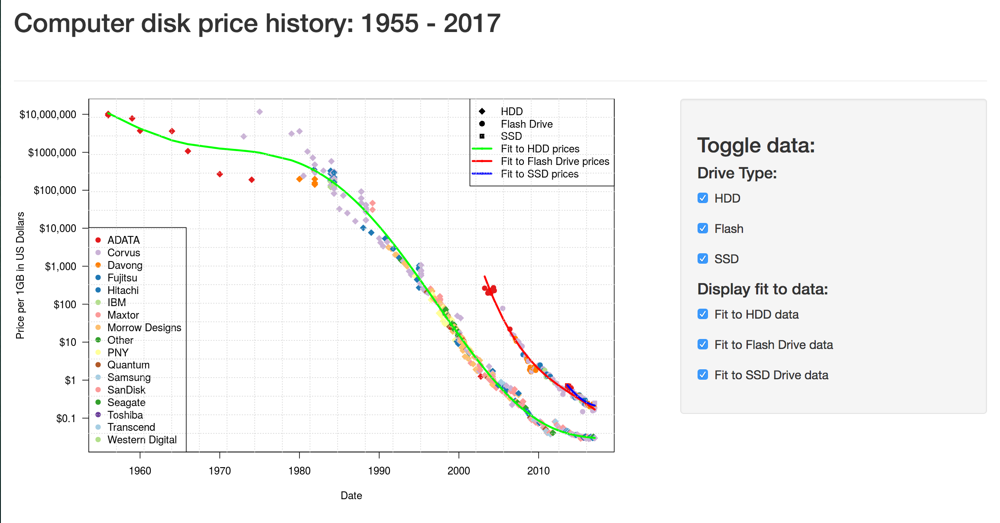

---
title       : History of computer disk prices 1956-2016
subtitle    : 
author      : Julia Hoffman
job         : June 30, 2017
framework   : io2012        # {io2012, html5slides, shower, dzslides, ...}
highlighter : highlight.js  # {highlight.js, prettify, highlight}
hitheme     : tomorrow      # 
widgets     : [mathjax, quiz, bootstrap] # {mathjax, quiz, bootstrap}
mode        : selfcontained # {standalone, draft}
knit        : slidify::knit2slides
---  .class1 #id1 .class1 #id1 bg:url(assets/img/blackboard-wallpapers1.jpg)

## Introduction

This presentation is a part of the course project assignment for the Coursera 
*Developing Data Products* class. The peer assessed assignment has two parts. 
The first part is to create a Shiny application and deploy it on RStudio servers. 
Next, a reproducible pitch presentation about the application has to be made with 
Slidify or RStudio Presenter. This presentation adresses the second part of the course project.

The application developed for the first part of the assignment is avalilable at:

<a href="https://kurowska.shinyapps.io/disk_prices>https://kurowska.shinyapps.io/disk_prices</a>

The source code for ui.R and server.R files are available on GitHub:

<a href="https://github.com/kurowska/disk_prices/">https://github.com/kurowska/disk_prices/</a>

--- .class1 #id2 bg:#216357

## Computer disk prices

**Prediction:**
"The cost for 128 kilobytes of memory will fall below U$100 in the near future." 
(Creative Computing magazine, December 1981, page 6)

"At `$`100 for 128 kilobytes, the price of 256 megabytes comes to `$`200,000." 

"Make it bigger, faster, cheaper. "

— Al Shugart 
Chairman and CEO of Seagate Technology Inc. 
(originally Shugart Technology Inc.) 

The cost of hard drives, used in computers for storing data in large quantities, 
has been falling rapidly for many years. 

---  .class1 #id3 bg:#216357

## Shiny application

 
My application uses data gathered from the following sources:

* <a href="http://www.mkomo.com/cost-per-gigabyte">mkomo.com</a>
* <a href="http://www.jcmit.net/diskprice.htm">jcmit.com</a>

I have processed the data and used it to show how storage prices changed over 
the years (1956 - 2017). The user may toggle various kinds of drives and fits 
that show general trend for prices per GB of storage.

---  .class1 #id4 bg:#216357

## The application 

An example screen shot from the application:

